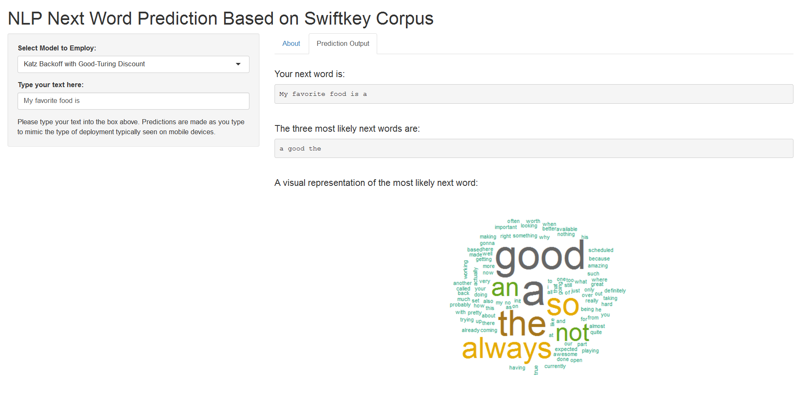

<style>
.reveal p {
    font-size: .75em;
}

.reveal small {
    width: 500px;
}

.reveal .slides {
    text-align: left;
}

.reveal .roll {
    vertical-align: text-bottom;
}

code {
    color: red;
}

.reveal pre code { 
     height: 250px;
}

.reveal section img { 
  background:none; 
  border:none; 
  box-shadow:none; 
  }
  
</style>

```{r setup, include=FALSE}
knitr::opts_chunk$set(echo = FALSE, message = FALSE)

knitr::opts_knit$set(root.dir = "..")

library(data.table)
library(tm)
library(wordcloud)
library(knitr)

```

```{r load, cache = TRUE, include=FALSE}

setwd('..')
UniGram <- readRDS("Shiny_App/UniGram_Cutoff.rds")
BiGram <- readRDS("Shiny_App/BiGram_Cutoff.rds")
TriGram <- readRDS("Shiny_App/TriGram_Cutoff.rds")
QuadGram <- readRDS("Shiny_App/QuadGram_Cutoff.rds")
QuadGram_test <- readRDS("NGrams/QuadGrams_test.rds")

katzgt_quad <- function(x){

  x <- VCorpus(VectorSource(x))
  x <- tm_map(x, removePunctuation)
  x <- tm_map(x,content_transformer(tolower))
  x <- tm_map(x, removeNumbers)
  x <- tm_map(x, stripWhitespace)
  
  x <- unlist(x)[1]
  
  x <- unlist(strsplit(x, split = " "))
  last.one <- x[length(x)]
  last.two <- paste(x[length(x)-1],last.one)
  last.three <- paste(x[length(x)-2], last.two)
  
  QuadGram_rel <- QuadGram[nmin1.gram == last.three, j = list(nmin1.gram, word, freq, prob = (freq_adj)/sum(freq))]
  
  TriGram_rel <- TriGram[nmin1.gram == last.two & !(word %in% QuadGram_rel$word), 
                         j = list(nmin1.gram, word, freq, prob = (1 - sum(QuadGram_rel$prob)) * (freq_adj)/sum(freq))]
  
  BiGram_rel <- BiGram[nmin1.gram == last.one & !(word %in% QuadGram_rel$word) & !(word %in% TriGram_rel$word), j
                       = list(nmin1.gram, word, freq, 
                              prob = (1 - sum(QuadGram_rel$prob) - sum(TriGram_rel$prob)) * (freq_adj)/sum(freq))]
  
  UniGram_rel <- UniGram[!(word %in% QuadGram_rel$word) & !(word %in% TriGram_rel$word) & !(word %in% BiGram_rel$word), 
                         j = list(word, freq, 
                                  prob = (1 - sum(QuadGram_rel$prob) - sum(TriGram_rel$prob) - sum(BiGram_rel$prob)) * freq/sum(freq))]
  
  Quad_out <- rbindlist(list(QuadGram_rel[j = list(word, prob)], TriGram_rel[j = list(word, prob)], 
                             BiGram_rel[j = list(word, prob)],UniGram_rel[j = list(word, prob)]))
  Quad_out <- Quad_out[order(-prob)]
  
  return(Quad_out[1,1])

}

```


## The Use Case

In today's mobile world, Natural Langague Processing (NLP) is all around us. This Data Science Capstone, administered in concert with **SwiftKey**, is focused on the development of an NLP model capable of predicting the next word in a text string based on the provided SwiftKey [English language corpus](https://d396qusza40orc.cloudfront.net/dsscapstone/dataset/Coursera-SwiftKey.zip). 
<br>
<br>
 
### The Links

Several products were developed to support this Capstone. They can be found below:

1. The Milestone Report: [link here](http://rpubs.com/cwalsh/300582)

2. The Next Word Prediction Shiny application: [link here](https://cwalsh.shinyapps.io/data_science_capstone_next_word_prediction/)

3. The Presentation: [link here](https://cwalsh.shinyapps.io/data_science_capstone_next_word_prediction/)

4. The Code: [link here](https://github.com/chwalsh/10-JHU-Capstone)


---


## The Algorithm

```{r Performance, cache = TRUE, echo = FALSE, message=FALSE}

set.seed(522)
sample <- QuadGram_test[sample(.N,10000)]
sample$predict <- sapply(sample$nmin1.gram, katzgt_quad)
sample$match <- sample$predict == sample$word
accuracy <- sum(sample$match)/length(sample$match)

```

Several steps were taken in order to develop the underlying NLP model:

* The Corpus was ingested and cleansed using `tm` and `stringi`; this process included: converting characters to a standard encoding;  transforming to lowercase; and stripping punctuation, numbers, and excess whitespace 

* The Corpus was tokenized into N-Grams using `RWeka`; for the purpose of this model, UniGrams, BiGrams, TriGrams, and 4-Grams were developed

* The **Good-Turing discount** was calculated based on N-Gram frequencies to smooth the eventual model[^1](http://www.cs.cornell.edu/courses/cs4740/2014sp/lectures/smoothing+backoff.pdf)

* A simple **Katz Backoff model** was developed based on these adjusted N-Gram frequencies to estimate the probability of each potential next word[^2](http://www.cs.cornell.edu/courses/cs4740/2014sp/lectures/smoothing+backoff.pdf)

* To optimize for performance on the Shiny server, the underlying N-Gram frequency tables were pruned; both **cutoff** and **weighted difference** methods were tested, with better model performance (`r accuracy*100`% accuracy) at the desired frequency `data.table` size observed via the **cutoff** method[^3](https://pdfs.semanticscholar.org/6c8c/dff44ef74915a0276a7e1aba939eae7eefa7.pdf)


---

## The App


This algorithm was then deployed via a [Shiny app](https://cwalsh.shinyapps.io/data_science_capstone_next_word_prediction/). When text is input into the box, the Model Output tab provides three unique ways to interact with the model output:

1. The next word with the highest probability is appended directly onto the input text to display the full expected text string

2. The three next words with the highest probabilities are displayed; think of this as the three predictions typically provided during text input on a mobile device

3. A WordCloud is displayed based on the probabilities of the top 100 most likely next words

```{r image, echo = FALSE, out.height="400px", fig.align= "center"}


```


---


## Next Steps

* As the intial exploratory analysis shows, *context matters*; N-Gram frequencies differ across blog, twitter, and news corpora. While all three sources are consolidated in the underlying model, greater accuracy could potentially be gained by dynamically selecting corpora sources based on application.

* 80% of the overall corpus was initially used to train the model, however this resulted in final frequency tables of approximately **800 MB**. Memory considerations required pruning down to approximately **12 MB** to deploy at the desired speed on a Shiny server. While some testing was performed to select a pruning method, additional techniques can be explored to further minimize accuracy loss.

* Good-Turing discounting was implemented to help smooth the model as it outperformed a simple absolute discount initially used; additional methods, including Kneser-Key, could potentially be explored to further refine model accuracy.

* The app could be updated to dynamically update the underlying frequency tables based on user input; this would allow the model to "learn" from repeated use.


